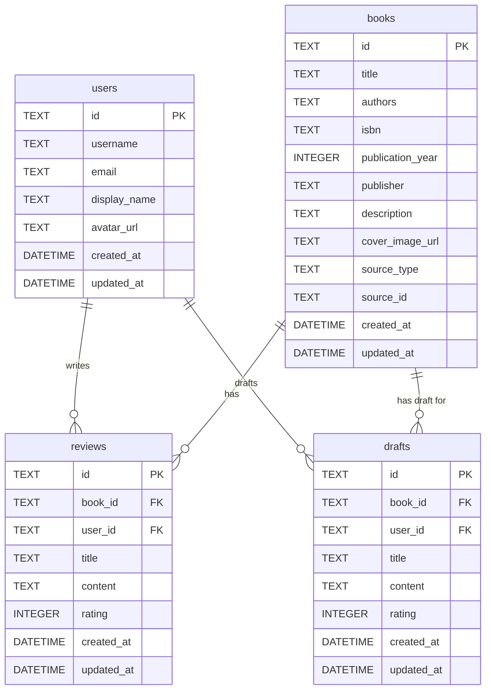

# データベース設計

## ER図



## テーブル定義

### books テーブル
書籍情報を管理するメインテーブル

| カラム名 | データ型 | 制約 | 説明 |
|---------|---------|------|------|
| id | TEXT | PRIMARY KEY | UUID |
| title | TEXT | NOT NULL | 書籍タイトル |
| authors | TEXT | NULL | 著者名（カンマ区切り） |
| isbn | TEXT | NULL | ISBN-10/13 |
| publication_year | INTEGER | NULL | 出版年 |
| publisher | TEXT | NULL | 出版社 |
| description | TEXT | NULL | 本の概要 |
| cover_image_url | TEXT | NULL | 表紙画像URL |
| source_type | TEXT | NOT NULL | 取得元 (ndl/amazon/manual) |
| source_id | TEXT | NOT NULL | 外部システムのID |
| created_at | DATETIME | DEFAULT CURRENT_TIMESTAMP | 作成日時 |
| updated_at | DATETIME | DEFAULT CURRENT_TIMESTAMP | 更新日時 |

**制約:**
- UNIQUE(source_type, source_id) - 同じソースからの重複登録を防止
- CHECK(source_type IN ('ndl', 'amazon', 'manual'))

**著者名の扱い:**
- 複数著者の場合は「村上春樹, 安西水丸」のようにカンマ区切りで格納
- UI上では著者名をクリックで著者名検索を実行
- 正規化は行わずシンプルな文字列として管理

### users テーブル
ユーザー情報を管理

| カラム名 | データ型 | 制約 | 説明 |
|---------|---------|------|------|
| id | TEXT | PRIMARY KEY | UUID |
| username | TEXT | NOT NULL, UNIQUE | ユーザー名（ログイン用） |
| email | TEXT | NOT NULL, UNIQUE | メールアドレス |
| display_name | TEXT | NOT NULL | 表示名 |
| avatar_url | TEXT | NULL | アバター画像URL |
| created_at | DATETIME | DEFAULT CURRENT_TIMESTAMP | 作成日時 |
| updated_at | DATETIME | DEFAULT CURRENT_TIMESTAMP | 更新日時 |

### reviews テーブル
書籍の感想を管理

| カラム名 | データ型 | 制約 | 説明 |
|---------|---------|------|------|
| id | TEXT | PRIMARY KEY | UUID |
| book_id | TEXT | NOT NULL, FOREIGN KEY | 書籍ID |
| user_id | TEXT | NOT NULL, FOREIGN KEY | 投稿ユーザーID |
| title | TEXT | NOT NULL | 感想タイトル |
| content | TEXT | NOT NULL | 感想内容（Markdown） |
| rating | INTEGER | NULL | 5段階評価 (1-5) |
| created_at | DATETIME | DEFAULT CURRENT_TIMESTAMP | 作成日時 |
| updated_at | DATETIME | DEFAULT CURRENT_TIMESTAMP | 更新日時 |

**制約:**
- CHECK(rating BETWEEN 1 AND 5) - 評価は1-5の範囲

### drafts テーブル
感想の下書きを管理（自動保存機能用）

| カラム名 | データ型 | 制約 | 説明 |
|---------|---------|------|------|
| id | TEXT | PRIMARY KEY | UUID |
| book_id | TEXT | NOT NULL, FOREIGN KEY | 書籍ID |
| user_id | TEXT | NOT NULL, FOREIGN KEY | ユーザーID |
| title | TEXT | NULL | 下書きタイトル |
| content | TEXT | NULL | 下書き内容（Markdown） |
| rating | INTEGER | NULL | 下書き評価 |
| created_at | DATETIME | DEFAULT CURRENT_TIMESTAMP | 作成日時 |
| updated_at | DATETIME | DEFAULT CURRENT_TIMESTAMP | 更新日時 |

**制約:**
- UNIQUE(book_id, user_id) - 1ユーザーにつき1本につき1下書き

## インデックス設計

### パフォーマンス最適化用インデックス

```sql
-- 書籍タイトル検索用
CREATE INDEX idx_books_title ON books(title);

-- 外部API重複チェック用
CREATE INDEX idx_books_source ON books(source_type, source_id);

-- 感想の書籍別取得用
CREATE INDEX idx_reviews_book_id ON reviews(book_id);

-- 最新感想取得用
CREATE INDEX idx_reviews_created_at ON reviews(created_at DESC);

-- 著者名検索用
CREATE INDEX idx_books_authors ON books(authors);

-- ユーザー認証用
CREATE INDEX idx_users_username ON users(username);
CREATE INDEX idx_users_email ON users(email);

-- ユーザーの感想取得用
CREATE INDEX idx_reviews_user_id ON reviews(user_id);

-- 下書き取得用
CREATE INDEX idx_drafts_user_book ON drafts(user_id, book_id);
```

## 初期化スクリプト

```sql
-- テーブル作成
CREATE TABLE users (
    id TEXT PRIMARY KEY,
    username TEXT NOT NULL UNIQUE,
    email TEXT NOT NULL UNIQUE,
    display_name TEXT NOT NULL,
    avatar_url TEXT,
    created_at DATETIME DEFAULT CURRENT_TIMESTAMP,
    updated_at DATETIME DEFAULT CURRENT_TIMESTAMP
);

CREATE TABLE books (
    id TEXT PRIMARY KEY,
    title TEXT NOT NULL,
    authors TEXT,
    isbn TEXT,
    publication_year INTEGER,
    publisher TEXT,
    description TEXT,
    cover_image_url TEXT,
    source_type TEXT NOT NULL CHECK (source_type IN ('ndl', 'amazon', 'manual')),
    source_id TEXT NOT NULL,
    created_at DATETIME DEFAULT CURRENT_TIMESTAMP,
    updated_at DATETIME DEFAULT CURRENT_TIMESTAMP,
    UNIQUE(source_type, source_id)
);

CREATE TABLE reviews (
    id TEXT PRIMARY KEY,
    book_id TEXT NOT NULL,
    user_id TEXT NOT NULL,
    title TEXT NOT NULL,
    content TEXT NOT NULL,
    rating INTEGER CHECK (rating BETWEEN 1 AND 5),
    created_at DATETIME DEFAULT CURRENT_TIMESTAMP,
    updated_at DATETIME DEFAULT CURRENT_TIMESTAMP,
    FOREIGN KEY (book_id) REFERENCES books(id) ON DELETE CASCADE,
    FOREIGN KEY (user_id) REFERENCES users(id) ON DELETE CASCADE
);

CREATE TABLE drafts (
    id TEXT PRIMARY KEY,
    book_id TEXT NOT NULL,
    user_id TEXT NOT NULL,
    title TEXT,
    content TEXT,
    rating INTEGER CHECK (rating BETWEEN 1 AND 5),
    created_at DATETIME DEFAULT CURRENT_TIMESTAMP,
    updated_at DATETIME DEFAULT CURRENT_TIMESTAMP,
    UNIQUE(book_id, user_id),
    FOREIGN KEY (book_id) REFERENCES books(id) ON DELETE CASCADE,
    FOREIGN KEY (user_id) REFERENCES users(id) ON DELETE CASCADE
);

-- インデックス作成
CREATE INDEX idx_books_title ON books(title);
CREATE INDEX idx_books_authors ON books(authors);
CREATE INDEX idx_books_source ON books(source_type, source_id);
CREATE INDEX idx_users_username ON users(username);
CREATE INDEX idx_users_email ON users(email);
CREATE INDEX idx_reviews_book_id ON reviews(book_id);
CREATE INDEX idx_reviews_user_id ON reviews(user_id);
CREATE INDEX idx_reviews_created_at ON reviews(created_at DESC);
CREATE INDEX idx_drafts_user_book ON drafts(user_id, book_id);
```

## データ移行戦略

### バージョン管理
- マイグレーションファイル形式: `YYYYMMDD_HHmmss_description.sql`
- 例: `20250908_000000_initial_schema.sql`

### 将来的な拡張予定
- ユーザー認証システム (users テーブル追加)
- タグ機能 (tags, book_tags テーブル追加)
- お気に入り機能 (favorites テーブル追加)